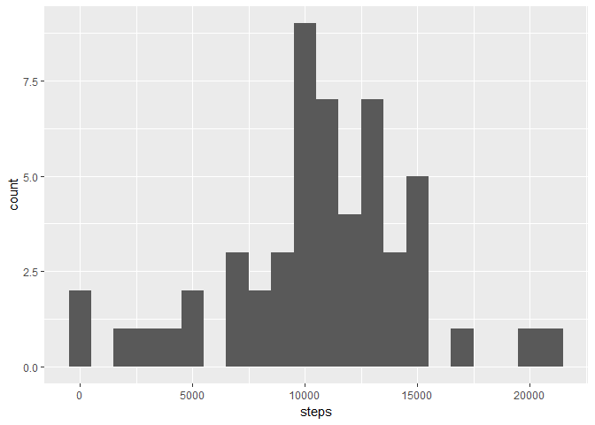
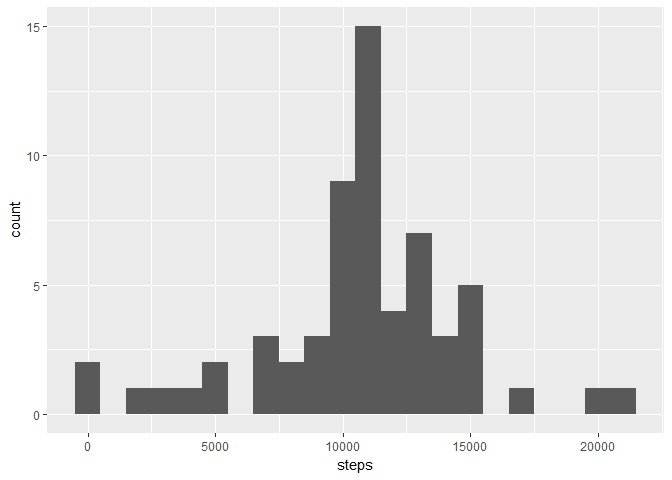

##Loading and preprocessing the data


```r
activity <- read.csv("activity.csv")
```

##Histogram of the total number of steps taken each day


```r
totalSteps <- aggregate(steps ~ date, activity, sum)
library(ggplot2)
g <- ggplot(totalSteps,aes(steps))
 g+ geom_histogram(binwidth = 1000)
```

<!-- -->

##Mean and median number of steps taken each day


```r
mean_totalSteps <- mean(totalSteps$steps)
median_totalSteps <- median(totalSteps$steps)
```

###Mean of steps taken each day : 1.0766189\times 10^{4}  

###Median of steps taken each day : 10765

##Time series plot of the average number of steps taken


```r
meansteps_interval <- aggregate(steps ~ interval, activity, mean)
 
 g1 <- ggplot(data=meansteps_interval,aes(x=interval,y=steps))
 g1+geom_line()
```

<!-- -->

```r
 max <-  max(meansteps_interval$steps)
 interval_maxstep_ind <- which(meansteps_interval$steps == max)
 interval_maxstep <- meansteps_interval$interval[interval_maxstep_ind]
```

### 5 minute interval with maximum number of steps: 835


```r
na_arr <-  is.na(activity$steps)
sum_na <- sum(na_arr)

for (i in seq_along(activity$steps)) {
   interval <- activity$interval[i]
   step <- activity$steps[i]
  if(is.na(step)){
    activity$steps[i] <- meansteps_interval$steps[meansteps_interval$interval == interval]
   }
   
 }
```

**Created new data set using mean of 5 minute interval for NAs.** 

###Histogram of new data set


```r
totalSteps_n <- aggregate(steps ~ date, activity, sum)
 mean_totalSteps_n <- mean(totalSteps_n$steps)
 median_totalSteps_n <- median(totalSteps_n$steps)
 
 g <- ggplot(totalSteps_n,aes(steps))
 g+ geom_histogram(binwidth = 1000) 
```

<!-- -->

###New Mean of steps taken each day : 1.0766189\times 10^{4}  

###New Median of steps taken each day : 1.0766189\times 10^{4}

**Comparing old & new values : Mean value remains unchanged while median is now equal to mean.**


```r
activity$wkday <- weekdays(as.Date(as.character(activity$date)))
 
 wkend_dt <- unique(activity$date[activity$wkday == "Saturday" | activity$wkday == "Sunday"])
 wkdy_dt <- unique(activity$date[!(activity$wkday == "Saturday" | activity$wkday == "Sunday")])
 
 activity_wkend <- subset(activity,date %in% wkend_dt)
 activity_wkdy <-  subset(activity,date %in% wkdy_dt)
 
 activity_wkend$iswd <- "weekend"
 activity_wkdy$iswd <- "weekday"
 
activity_n2 <- rbind(activity_wkdy,activity_wkend)  

totalSteps_n2 <- aggregate(steps ~ interval+iswd, activity_n2, mean)
```

###Time series plot of the average number of steps taken on weekdays & weekends


```r
g2 <- ggplot(data=totalSteps_n2,aes(x=interval,y=steps))
g2+geom_line()+
facet_grid(iswd ~.)
```

<!-- -->

